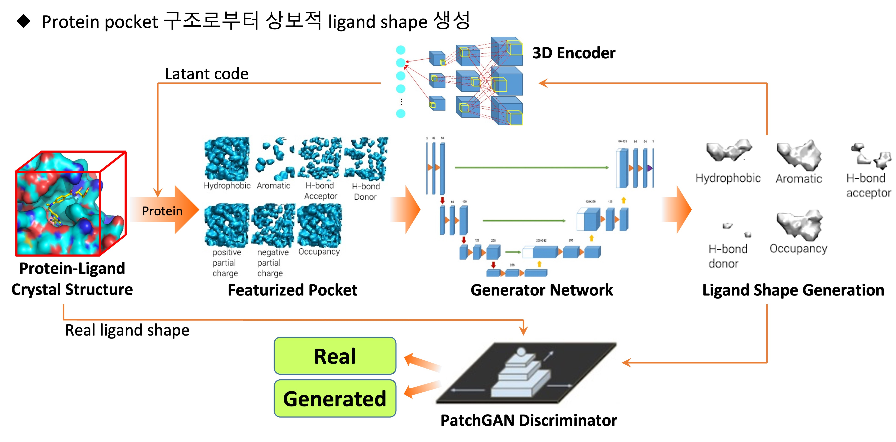
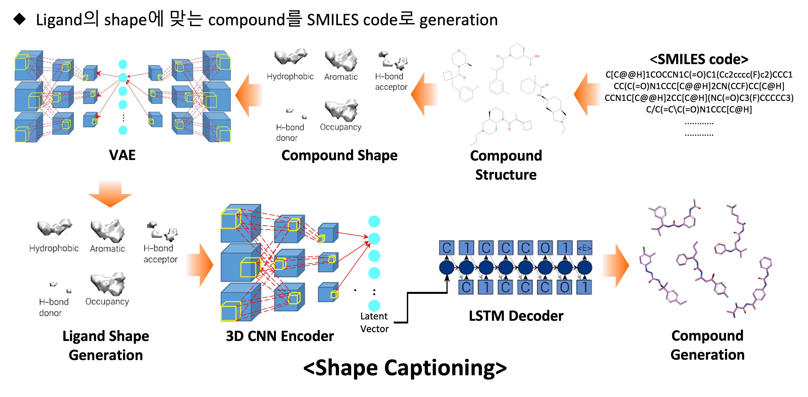

# Structure-based Drug Discovery with Deep Learning (LiGANN)

## Overview

This repository is an unofficial PyTorch re-implementation of the LiGANN architecture.

Since the original implementation was not publicly released, the model was reconstructed based on the descriptions provided in the paper.

The overall training pipeline and architecture follow the LiGANN framework, while the voxel feature generation pipeline was independently implemented using custom physicochemical features.

Original paper:

Masuda et al.
LiGANN: Structure-Based De Novo Drug Design with Generative Adversarial Networks

---

## Motivation

Drug molecules bind to proteins through a combination of physicochemical interactions such as electrostatic attraction, hydrogen bonding, hydrophobic effects, and van der Waals forces.

The goal of this project is to learn these interactions directly from voxelized protein binding pockets and generate ligand candidates that are compatible with the local binding environment.

---

## Pipeline Overview

  

  <em>
  Figure adapted from the LiGANN paper.  
  The model generates ligand pharmacophore shapes conditioned on protein binding pockets using a 3D BicycleGAN-based architecture.
  </em>

---

## Shape Captioning

  

  <em>
  Figure adapted from the LiGANN paper.  
  Generated ligand shapes are encoded into latent representations and decoded into molecular SMILES strings using an LSTM-based captioning model.
  </em>

